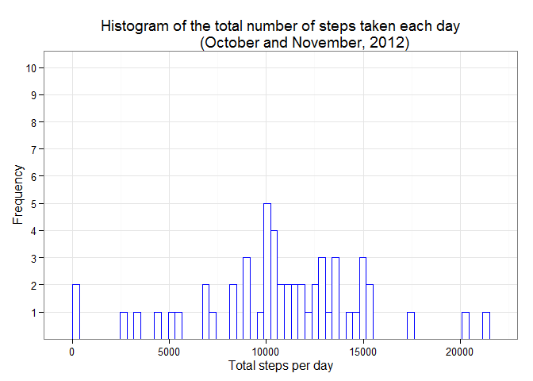
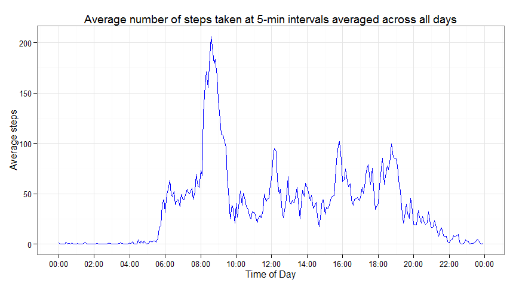
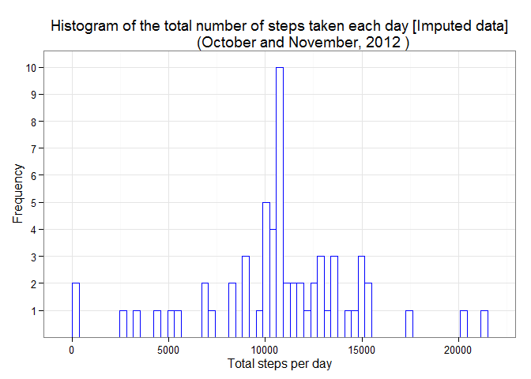
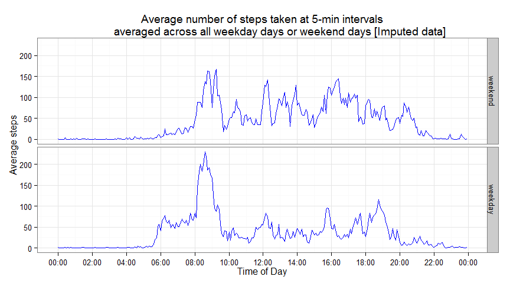

# Reproducible Research: Peer Assessment 1
Before the start of data analysis, all the necessary packages for data manipulation and data presentation are loaded.
Directory *figures/* that will include all the figures has been set up as required by the assignment. Also, option
controlling decimal number output was changed to avoid automatic rounding of numbers in output.

```r
require(knitr)
require(stats)
require(ggplot2)
require(scales)
require(plyr)
opts_chunk$set(fig.path = "figures/")
options(scipen = 10)
```


## Loading and preprocessing the data
Dataset is comprised of a single *.zip* archive with *.csv* file. First, the contents of the *activity.zip* archive are unzipped and the data is loaded in *activityData* dataframe. The code assumes that all the data is in the same
directory, and that this directory is set as the working directory. Dataset includes 17,568 observations, with three
distinct variables:

- **steps**: *int* variable; Number of steps taking in a 5-minute interval (missing values are coded as NA)
- **date**: *factor* variable with 61 levels for 61 days; The date on which the measurement was taken in YYYY-MM-DD format
- **interval**: *int* variable; Identifier for the 5-minute interval in which measurement was taken


```r
# extracting name of the .csv file inside zip archive "activity.zip"; unzipping the contents of zip archive
fileName <- unzip("activity.zip", list = T)$Name
unzip(zipfile = "activity.zip")
# loading .csv data into dataframe "activityData"
activityData <- read.csv(fileName)
rm(fileName)
```


## What is mean total number of steps taken per day?
To get mean and median numbers of steps taken per day, first total steps per day need to be calculated. These values
are stored in a dataframe *stepsPerDay*. Function *aggregate* was used for calculating total number of steps taken per each day. Missing (NA) values are ignored, as suggested by the assignment.

```r
# counting number of total steps per day (ignoring missing (NA) values)
stepsPerDay <- aggregate(steps ~ date, activityData, sum)  
colnames(stepsPerDay) <- c("date", "totalSteps")
# mean of total number of steps taken per day
meanPrint <- mean(stepsPerDay$totalSteps, na.rm = T)
# median of total number of steps taken per day
medianPrint <- median(stepsPerDay$totalSteps, na.rm = T)
```

The mean of total number of steps taken per day is **10766.1887**.
The median of total number of steps taken per day is **10765**.

Mean and median values calculated above can be observed on the following histogram plot of the total number of steps taken each day. Highest bars are exactly around values of 10000. There are total of 53 different values (for 53 different days) in the histogram plot. *Binwidth* option has been changed from default value to more accurately show these data trends.

```r
# ggplot2 histogram of the total number of steps taken each day
ggplot(stepsPerDay, aes(x = totalSteps)) +
    geom_histogram(colour = "blue", fill = "white", 
                   binwidth = (max(stepsPerDay$totalSteps)-min(stepsPerDay$totalSteps))/60) +
    theme_bw() +
    xlab("Total steps per day") +
    ylab("Frequency") +
    scale_y_discrete(breaks = seq(1, 10, by = 1), limits = seq(1, 10, by = 1)) +
    ggtitle("Histogram of the total number of steps taken each day
            (October and November, 2012)")
```

 


## What is the average daily activity pattern?
First, the average number of steps taken per each 5-minute interval accros all days has to be calculated. These values are stored in a dataframe *stepsPerInterval*. Function *aggregate* was used for calculating this values. 

```r
stepsPerInterval <- aggregate(steps ~ interval, activityData, mean)
colnames(stepsPerInterval) <- c("interval", "avgSteps")
# 5-minute interval, on average across all the days in the dataset, that contains the maximum number of steps
intervalPrint <- stepsPerInterval$interval[which.max(stepsPerInterval$avgSteps)]
# maximum value of that interval
maxPrint <- max(stepsPerInterval$avgSteps, na.rm = T)
```

The 5-minute interval which contains the maximum number of steps taken on average across all the days in the dataset is **835**.
The maximum number of steps taken on average for that particular 5-minute interval is **206.1698**.

The following time series plot confirms results from the above. 5-minute interval (starting at 8:35 o'clock) with the maximum value is exactly a bit to the right from 8:00. Generally, activity is highest in the morning (between 8:00-9:00 o'clock), which probably means that person that conducted measurements walked to work or school. Also, there is almost none activity during the night, and very few early in the morning or in the late evening. All intervals are for better plot accuracy converted to POSIXct values because *ggplot* "understands" that datetime format. This way, possible treatment of intervals on x-axis as a numerical scale instead of a time scale, and unintentional round up for "missing" values (i.e. intervals ... 50, 55, 100, 105 ...), is avoided.

```r
# convert intervals to time of day
stepsPerInterval$timeOfDay <- as.POSIXct(strptime(sprintf("%04d", stepsPerInterval$interval), "%H%M"))
# ggplot2 time series plot of the 5-minute interval (x-axis) and the average number of steps taken, 
# averaged across all days (y-axis)
g <- ggplot(data = stepsPerInterval, aes(x = timeOfDay, y = avgSteps))
g + geom_line(colour = "blue") +
    scale_x_datetime(breaks = "2 hour", labels = date_format("%H:%M")) +
    theme_bw() +
    xlab("Time of Day") +
    ylab("Average steps") +
    ggtitle("Average number of steps taken at 5-min intervals averaged across all days")
```

 


## Imputing missing values
Before filling in missing values with new values, the total number of missing values in the dataset is calculated and reported.

```r
# total number of missing values in the dataset
missingPrint <- sum(is.na(activityData$steps))
```

Total number of missing values in the dataset is **2304**. If the original dataset is examined a bit, this result is completely logical. All missing values are regularly distributed, so to speak, because if data is missing on a particular day, it is missing completely for that whole day. The above value is therefore the result of 8 days with completely missing values (2012-10-01, 2012-10-08, 2012-11-01, 2012-11-04, 2012-11-09, 2012-11-10, 2012-11-14, 2012-11-30). This fact has important implications for the remainder of the report.

Strategy for imputing missing values is based on the technique which uses another function and the *plyr* package. First, new function (*imputeMean*) for imputing mean values is defined. New dataframe *activityDataImputed* is created, and each missing value is filled with the mean for that 5-minute interval. To get the same look of the original dataframe (*activityData*), data is sorted by date and interval, and rownames are renumbered.

```r
# technique to replace missing (NA) values with mean by subset in R and the "imputeMean" function 
imputeMean <- function(x) replace(x, is.na(x), mean(x, na.rm = T))

# create a new dataset that is equal to the original dataset, but with the 
# missing data filled in with means for that 5-minute interval
activityDataImputed <- plyr::ddply(activityData[1:3],
                                   .(interval),
                                   transform,
                                   steps = imputeMean(steps),
                                   date = date,
                                   interval = interval)
# sort by date and interval (as was the original dataframe "activityData")
activityDataImputed <- activityDataImputed[order(activityDataImputed$date, 
                                                 activityDataImputed$interval), ]
# renumber rownames
row.names(activityDataImputed) <- 1 : nrow(activityDataImputed)
```

Newly created dataframe with imputed data is used to compute new values for mean and median of total number of steps taken per day. These values are stored in a dataframe *stepsPerDayImputed*. The same procedure as with the data with missing values is used.

```r
stepsPerDayImputed <- aggregate(steps ~ date, activityDataImputed, sum)  
colnames(stepsPerDayImputed) <- c("date", "totalSteps")
# mean of total number of steps taken per day (imputed dataset)
meanPrint <- mean(stepsPerDayImputed$totalSteps, na.rm = T)
# median of total number of steps taken per day (imputed dataset)
medianPrint <- median(stepsPerDayImputed$totalSteps, na.rm = T)
```

The mean of total number of steps taken per day (imputed dataset) is **10766.1887**.
The median of total number of steps taken per day (imputed dataset) is **10766.1887**.

The calculated mean and median values can be observed and confirmed on the following histogram plot of the total number of steps taken per each day. The overall mean value has not changed because all new values for previously missing days are now also set to the 5-minute interval means. Adding "partial" means to the dataset only confirmed the "aggregated" mean (10766.1887). Median has for the same reason "shifted" a bit to the right, to the same value as the mean. Because there are now several more values (in place for previously missing values) equal to the mean in the *stepsPerDayImputed* dataframe, this grouping of equal values "in the middle" changed the median. This can be seen on the following histogram plot, because now there are few even higher bars around 10000. There are total of 61 different values (for all 61 days of the dataset, as opossed to 53 in the first case with missing values) in the histogram plot. *Binwidth* option has been changed from default value to more accurately show these data trends.

```r
# ggplot2 histogram of the total number of steps taken each day (imputed dataset)
ggplot(stepsPerDayImputed, aes(x = totalSteps)) +
    geom_histogram(colour = "blue", fill = "white", 
                   binwidth = (max(stepsPerDayImputed$totalSteps)-min(stepsPerDayImputed$totalSteps))/60) +
    theme_bw() +
    xlab("Total steps per day") +
    ylab("Frequency") +
    scale_y_discrete(breaks = seq(1, 10, by = 1), limits = seq(1, 10, by = 1)) +
    ggtitle("Histogram of the total number of steps taken each day [Imputed data]
            (October and November, 2012 )")
```

 


## Are there differences in activity patterns between weekdays and weekends?
First, new factor variable in the dataset (*activityDataImputed$weekend*) with two levels, “weekday” and “weekend” indicating whether a given date is a weekday or weekend day, is created. Temporary variable *activityDataDate* calculates with the help of function *wday* which date falls on either weekday or wekeend. Then, the average number of steps taken per each 5-minute interval averaged accros all weekday days or weekend days is also calculated. These values are stored in a dataframe *stepsPerIntervalImputed*. Function *aggregate* was, as in the previous similar situations, used for calculating this values.

```r
# create temporary date variable "activityDataDate" used for assessing weekends
activityDataDate <- strptime(activityDataImputed$date, format = "%Y-%m-%d")
activityDataImputed$weekend <- ifelse(activityDataDate$wday == 0 | activityDataDate$wday == 6,
                                      activityDataImputed$weekend <- T,
                                      activityDataImputed$weekend <- F)
# factoring newly created variable - values "weekend" or "weekday"
activityDataImputed$weekend <- factor(activityDataImputed$weekend, levels = c(T, F), labels = c("weekend", "weekday"))
rm(activityDataDate)
# dataframe for storing aggregated data per each type of day (weekend or weekday) and 5-minute interval
stepsPerIntervalImputed <- aggregate(steps ~ interval + weekend, activityDataImputed, mean)
colnames(stepsPerIntervalImputed) <- c("interval", "weekend", "avgSteps")
```

The following time series plot visualizes results calculated above. Activity is generally higher during wekeends, it starts a bit later (probably longer sleep), and continues with varying intensity in the afternoon and in the late evening up to almost 22:00 o'clock. However, despite overall lower trend, a bit higher maximum values of average number of steps have been achieved during weekdays. Night time is for both cases characterized with predictably low activity. All intervals are for better plot accuracy converted to POSIXct values because *ggplot* "understands" that datetime format. This way, possible treatment of intervals on x-axis as a numerical scale instead of a time scale, and unintentional round up for "missing" values (i.e. intervals ... 50, 55, 100, 105 ...), is avoided.

```r
# convert intervals to time of day
stepsPerIntervalImputed$timeOfDay <- as.POSIXct(strptime(sprintf("%04d", stepsPerIntervalImputed$interval), "%H%M"))
# ggplot2 time series panel plot of the 5-minute interval (x-axis) and the average number of steps taken, 
# averaged across all weekday days or weekend days (y-axis)
g <- ggplot(data = stepsPerIntervalImputed, aes(x = timeOfDay, y = avgSteps))
g + geom_line(colour = "blue") +
    facet_grid(weekend ~ .) +
    scale_x_datetime(breaks = "2 hour", labels = date_format("%H:%M")) +
    theme_bw() +
    xlab("Time of Day") +
    ylab("Average steps") +
    ggtitle("Average number of steps taken at 5-min intervals
            averaged across all weekday days or weekend days [Imputed data]")
```

 
